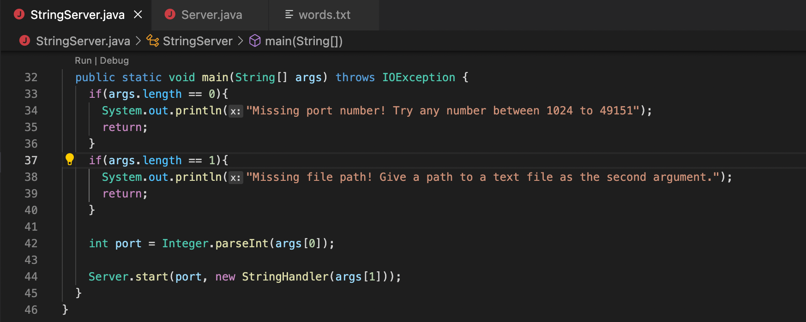
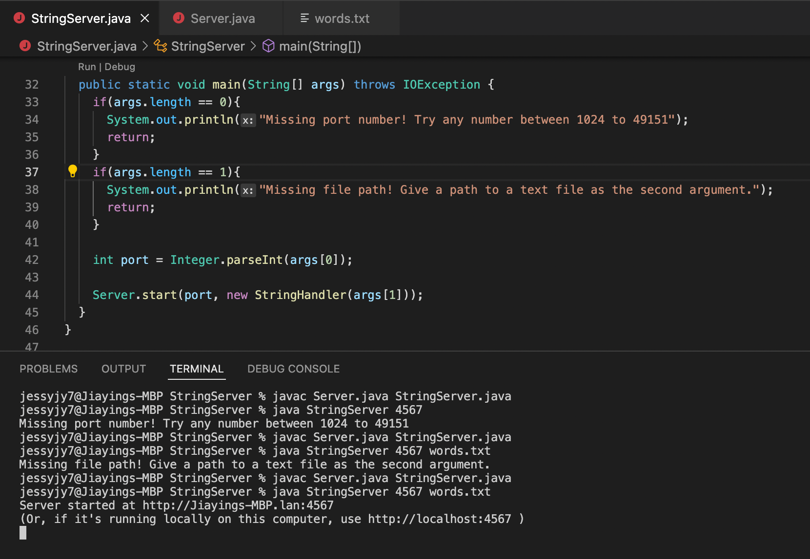

# Lab Report 5
## This lab report will contain two parts:
* Debugging Scenario
* Reflection

## Part 1: Debugging Scenario
* For this part of the report, I'll create a program that contains some sort of bugs and I'll pretend I don't know how to debug then ask our "TA" on Edsteem by a post, then the "TA" will help me out step-by-step.
* The program I wrote is a server that can allow you to edit strings, and I'm having problems with start the server.
* Now the Edstem post:

```
Title: StringServer fail to open

What environment are you using (computer, operating system, web browser, terminal/editor, and so on)?
Macbook pro; IOS; Safari; VS Code


Detail the symptom you're seeing. Be specific; include both what you're seeing and what you expected to see instead. Screenshots are great, copy-pasted terminal output is also great. Avoid saying “it doesn't work”.
I have my server code constructed and compiled successfully, but somehow it failed to start when I put in the command. I'll have the error screenshot attached below.


Detail the failure-inducing input and context. That might mean any or all of the command you're running, a test case, command-line arguments, working directory, even the last few commands you ran. Do your best to provide as much context as you can.
The server code wascompiled successfully with command `javac Server.java StringServer.java`, but somehow it failed to start when I typed the command `java StringServer 4567`, and the error message is `Missing port number! Try any number between 1024 to 49151`. I do have a port number, can you help me to find where I went wrong?
```


* A "TA" responded to my question:

```
"TA" noName: I think you are suppose to have a path for a `.txt` file listed at the end of the command like `java StringServer 4567 <someFile>.txt. Can you try that for me and share the screenshot of the result?
"TA" noName: Also since you did have a port number at first but the respond to your command is missing port number. Can you show me all your code by screenshot? 
```

* I tried the command the "TA" suggested and got a weird result, so I uploaded all the screenshots for help:

```
Me: I tried the command but I got a weird result again. Here's the result and all my code.
```


* The "TA" read all the screenshots and found the problem:

```
"TA" noName: I can see that you got a respond: "Missing file path! Give a path to a text file as the second argument." for command ` java StringServer 4567 words.txt` where you did have a path for your file. We can trace back to your code where you put the statement for your two responds in `Class StringServer`, check your if-statements and their conditions to see if you made mistake there that caused the class to print wrong statements.
```

* I looked at the `Class StringServer` at `StringServer.java` and found the bugs:

```
class StringServer {
  public static void main(String[] args) throws IOException {
    if(args.length == 1){
      System.out.println("Missing port number! Try any number between 1024 to 49151");
      return;
    }
    if(args.length == 2){
      System.out.println("Missing file path! Give a path to a text file as the second argument.");
      return;
    }

    int port = Integer.parseInt(args[0]);

    Server.start(port, new StringHandler(args[1]));
  }
}
```
* I'm suppose to have `if(args.length == 0)` instead of `if(args.length == 1)`
* I'm suppose to have `if(args.length == 1)` instead of `if(args.length == 2)`
* Then I fixed them and the code now looks like this:

* Then I compiled and restarted the code again:



* The bug is fixed and I go to Edstem to thank my "TA":
```
Me: Thank you so much! It works now!
```

* For this bug, I was "confused" by the statements that are shown after I typed in my command. Warning me of not having a port number even I do or not having a path for file even I do. The "TA" first reminded me that I missed the path at the end of the command line, that is a common mistake that beginners may always run into. After the syntax error is fixed, the statement is still the correct output even the command line is in a correct format. The "TA" suggested me to look at the place where I wrote the statements to find bugs. And I ended up having wrong conditions for the `if-statments.` Then I fixed the condition and the program works just fine.

## Part 2: Reflections
* This class is my favorite CSE class. Love all the staff! Prof. Joe's teaching is very insteresting and straightforward. The class materials are quite useful.
* I designed a scenario like this beacuse I made similar mistakes for the command line. Also because I was struggling on lab3's debugging and server develop. My tutor Andrew used a whiteboard to walk me through the buggy program and found out where it went wrong. Thank to his patience and help, I started to enjoy labs. However, I got sick for a long time and missed many course materials. I was super nervous when I went back to lab again, and felt I lost my mind by just looking at the lab tasks. Andrew again walked me through the ones I missed or I'm confused with step-by-step. Computer science is a subject that we learn based on failures, I think I learn the most at this class is not to be afriad of failures.


